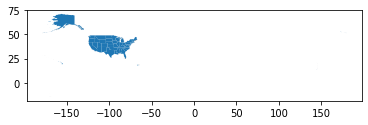

# census-cb
[](https://pypi.org/project/census-cb/)
[](https://pypi.org/project/census-cb/)
[](https://github.com/tcramm0nd/census-cb/blob/main/LICENSE)


`census-cb` is a wrapper for downloading and processing Cartography Boundaries from the US Census Bureau. It stands for Census Cartographic Boundaries; apparently that's confusing (but, like most things, it made sense at the time).

The goal of `census-cb` is to provide an easy way to get GIS information created by the United States Census Bureau. There's a wide variety of cartographic files availbable for download, such as state and county lines, voting district, Tribal subdivisions, and more!
## Entity Information
There are a designated set of entities available for download from the census bureau. Each year of available data has a specific set of available entities, and the shape of these entities may change from year to year. You can find a full list [pdf of available entities for download](https://www2.census.gov/geo/tiger/GENZ2020/2020_file_name_def.pdf) on the US Census Bureau site.
## Installation
Install using `pip`
```(python)
pip install census-cb
```

## Usage

```(python)
# Create a Boundary File for the desired entity
bf = BoundaryFile(2020, 'us', 'state', '500k')

# Create a processor for downloading and unpacking the data; this processor will return a GeoDataFrame
cbfp = CBFProcessor('gdf')

# Downloads and extracts the Boundary File.
cbfp.process_data(bf)
```

## Examples
Download and display the state boudnaries from the US Census Bureau.
```(python)
# Create a Boundary File for the US State Lines
state_boundary_file = BoundaryFile(2020, 'us', 'state', '500k')

# Create a processor that returns a GeoDataFrame
cbfp = CBFProcessor('gdf')

# Get the Data
state_lines = cbfp.process_data(state_boundary_file)

# See the Data
state_lines.plot()
state_lines.head()
```


<div>
<table border="1" class="dataframe">
  <thead>
    <tr style="text-align: right;">
      <th></th>
      <th>geometry</th>
      <th>STATEFP</th>
      <th>STATENS</th>
      <th>AFFGEOID</th>
      <th>GEOID</th>
      <th>STUSPS</th>
      <th>NAME</th>
      <th>LSAD</th>
      <th>ALAND</th>
      <th>AWATER</th>
    </tr>
  </thead>
  <tbody>
    <tr>
      <th>0</th>
      <td>MULTIPOLYGON (((144.64538 13.23627, 144.64716 ...</td>
      <td>66</td>
      <td>01802705</td>
      <td>0400000US66</td>
      <td>66</td>
      <td>GU</td>
      <td>Guam</td>
      <td>00</td>
      <td>543555847</td>
      <td>934337453</td>
    </tr>
    <tr>
      <th>1</th>
      <td>MULTIPOLYGON (((-94.71830 29.72885, -94.71721 ...</td>
      <td>48</td>
      <td>01779801</td>
      <td>0400000US48</td>
      <td>48</td>
      <td>TX</td>
      <td>Texas</td>
      <td>00</td>
      <td>676680588914</td>
      <td>18979352230</td>
    </tr>
    <tr>
      <th>2</th>
      <td>MULTIPOLYGON (((-86.95617 45.35549, -86.95463 ...</td>
      <td>55</td>
      <td>01779806</td>
      <td>0400000US55</td>
      <td>55</td>
      <td>WI</td>
      <td>Wisconsin</td>
      <td>00</td>
      <td>140292246684</td>
      <td>29343721650</td>
    </tr>
    <tr>
      <th>3</th>
      <td>MULTIPOLYGON (((-71.28802 41.64558, -71.28647 ...</td>
      <td>44</td>
      <td>01219835</td>
      <td>0400000US44</td>
      <td>44</td>
      <td>RI</td>
      <td>Rhode Island</td>
      <td>00</td>
      <td>2677759219</td>
      <td>1323691129</td>
    </tr>
    <tr>
      <th>4</th>
      <td>MULTIPOLYGON (((-72.03683 41.24984, -72.03496 ...</td>
      <td>36</td>
      <td>01779796</td>
      <td>0400000US36</td>
      <td>36</td>
      <td>NY</td>
      <td>New York</td>
      <td>00</td>
      <td>122049520861</td>
      <td>19256750161</td>
    </tr>
  </tbody>
</table>
</div>

## To Do
  - provide some better functionality for editing Entity Information after a BoundaryFile object is declared.